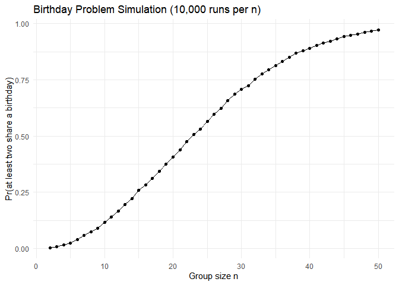
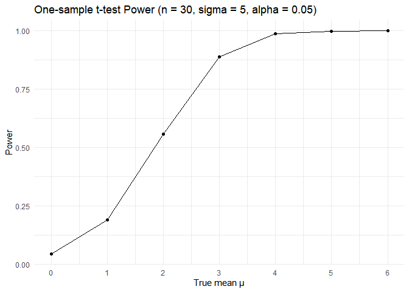
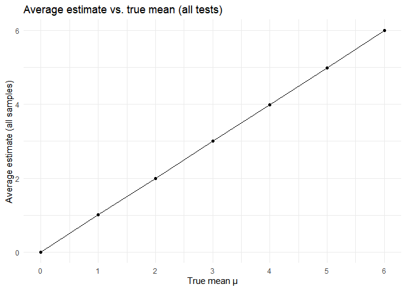
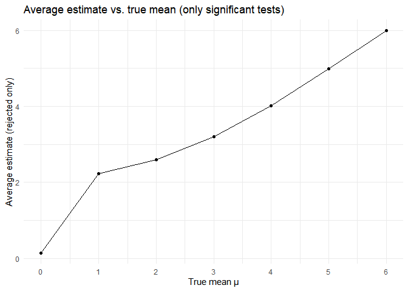

p8105_hw5_yd2865
================
Yan Duan
2025-11-11

I’m an R Markdown document!

## Problem 1

``` r
# checks whether there are duplicate birthdays in the group.
dup_birth = function(n, days = 365) {
  
  birth = sample(1:days, n, replace = TRUE) 
  
  length(unique(birth)) < length(birth) 
}
```

``` r
# simulate 10000 times and calculate the probability.
set.seed(123)
sim_results_df = 
  tibble(n = 2:50) |>
 mutate(
    prob = map_dbl(n,
      ~ mean(replicate(10000, dup_birth(.x))) 
  ))

sim_results_df
```

    ## # A tibble: 49 × 2
    ##        n   prob
    ##    <int>  <dbl>
    ##  1     2 0.0033
    ##  2     3 0.0079
    ##  3     4 0.0158
    ##  4     5 0.0248
    ##  5     6 0.0387
    ##  6     7 0.057 
    ##  7     8 0.0749
    ##  8     9 0.0885
    ##  9    10 0.116 
    ## 10    11 0.140 
    ## # ℹ 39 more rows

#### Make a plot

``` r
sim_results_df |>
  ggplot(aes(x = n, y = prob)) +
  geom_line() +
  geom_point() +
  labs(
    title = "Birthday Problem Simulation (10,000 runs per n)",
    x = "Group size n",
    y = "Pr(at least two share a birthday)"
  ) 
```

<!-- -->

**Comments**: As the number of group members increases, the probability
that at least two people in the group have the same birthday gradually
rises. When the group size is small (for example, less than 10 people),
the probability is very low and it is almost impossible for the same
birthday to occur. However, as the number continues to increase, this
probability grows very rapidly. When the number reaches around 23
people, the probability is already close to 0.5, meaning that the chance
of having the same birthday has reached half. By around 50 people, the
probability is almost close to 1, which means that it is almost certain
that there will be two people with the same birthday. This indicates
that a relatively small group can achieve an extremely high probability
of having overlapping birthdays.

## Problem 2

``` r
simulate_t_tests = function(mu, n = 30, sigma = 5, n_sim = 5000) {
  
  x_list = replicate(n_sim, rnorm(n, mean = mu, sd = sigma), simplify = FALSE)
  t_list = lapply(x_list, t.test, mu = 0) 

  map_dfr(seq_along(t_list), function(i) {
    ti = t_list[[i]]   
    broom::tidy(ti) |>
      transmute(
        mu_true = mu,
        sim = i,
        estimate,
        p.value,
        reject  = p.value < 0.05
      )
  })
}
```

``` r
set.seed(123)
mus = 0:6
results_list = lapply(mus, simulate_t_tests)
sim_results = bind_rows(results_list)

# The power of the test vs. true mean
summary_df =
  sim_results %>%
  group_by(mu_true) %>%
  summarise(
    power = mean(reject),                
    avg_mu_hat_all = mean(estimate),             
    avg_mu_hat_rej = mean(estimate[reject]),   
    .groups = "drop"
  )

summary_df
```

    ## # A tibble: 7 × 4
    ##   mu_true  power avg_mu_hat_all avg_mu_hat_rej
    ##     <int>  <dbl>          <dbl>          <dbl>
    ## 1       0 0.0446        0.00900          0.147
    ## 2       1 0.191         1.01             2.23 
    ## 3       2 0.556         1.99             2.60 
    ## 4       3 0.890         3.01             3.20 
    ## 5       4 0.987         3.98             4.01 
    ## 6       5 0.999         4.98             4.99 
    ## 7       6 1             5.99             5.99

#### Make a plot

``` r
# Power vs. mu_true
summary_df |> 
  ggplot(aes(x = mu_true, y = power)) +
  geom_line() +
  geom_point() +
  scale_x_continuous(breaks = mus) +
  labs(
    title = "One-sample t-test Power (n = 30, sigma = 5, alpha = 0.05)",
    x = "True mean μ",
    y = "Power"
  )
```

<!-- -->

**Comments**: The plot shows how the power of the one-sample t-test
increases as the true mean moves farther away from the null value of 0.
When true mean = 0,the power is approximately equal to the significance
level of 0.05. As the true mean increases, the power rises rapidly: when
true mean reaches around 2 to 3, the power has reached a relatively high
level; when true mean ≥ 4, the power approaches 1, meaning that the test
can almost always correctly reject the null hypothesis. This indicates
that the larger the effect size, the higher the power of the test.

``` r
# Average of mu_hat across all simulations.
summary_df |> 
  ggplot(aes(x = mu_true, y = avg_mu_hat_all)) +
  geom_line() +
  geom_point() +
  scale_x_continuous(breaks = mus) +
  labs(
    title = "Average estimate vs. true mean (all tests)",
    x = "True mean μ",
    y = "Average estimate (all samples)"
  ) 
```

<!-- -->

``` r
# Average of mu_hat when H0 is rejected.
summary_df |> 
  ggplot(aes(x = mu_true, y = avg_mu_hat_rej)) +
  geom_line() +
  geom_point() +
  scale_x_continuous(breaks = mus) +
  labs(
    title = "Average estimate vs. true mean (only significant tests)",
    x = "True mean μ",
    y = "Average estimate (rejected only)"
  )
```

<!-- -->

**Answer**: No. The sample average of μ_hat from only the tests where
the null hypothesis was rejected is not approximately equal to the true
value of μ, especially when μ is small. In the first plot, the points
are almost on the diagonal line. This indicates that the average
estimate μ_hat of all samples is basically consistent with the true mean
μ. That is, the sample mean is an unbiased estimator. However, in the
second plot, the curve no longer lies on the diagonal line. Especially
when μ ≤ 2, the average estimate is significantly higher than the true
mean. This happens because we only keep samples where the estimate was
far enough from zero to achieve significance, which selectively inflates
the mean.
