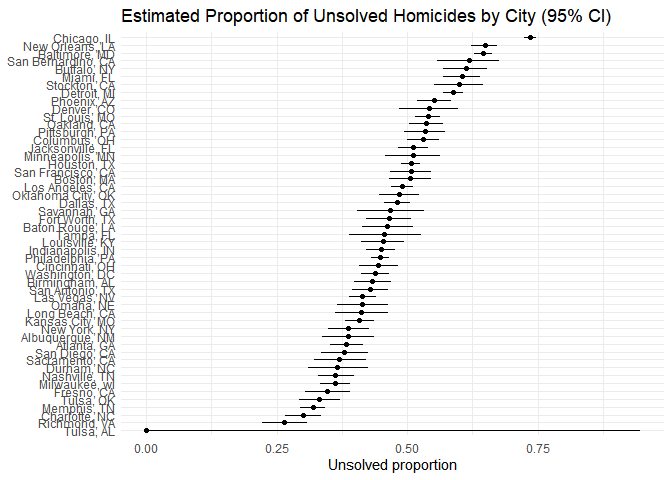

p8105_hw5_yd2865
================
Yan Duan
2025-11-11

I’m an R Markdown document!

## Problem 1

``` r
# checks whether there are duplicate birthdays in the group.
dup_birth = function(n, days = 365) {
  
  birth = sample(1:days, n, replace = TRUE) 
  
  length(unique(birth)) < length(birth) 
}
```

``` r
# simulate 10000 times and calculate the probability.
set.seed(123)
sim_results_df = 
  tibble(n = 2:50) |>
 mutate(
    prob = map_dbl(n,
      ~ mean(replicate(10000, dup_birth(.x))) 
  ))

sim_results_df
```

    ## # A tibble: 49 × 2
    ##        n   prob
    ##    <int>  <dbl>
    ##  1     2 0.0033
    ##  2     3 0.0079
    ##  3     4 0.0158
    ##  4     5 0.0248
    ##  5     6 0.0387
    ##  6     7 0.057 
    ##  7     8 0.0749
    ##  8     9 0.0885
    ##  9    10 0.116 
    ## 10    11 0.140 
    ## # ℹ 39 more rows

#### Make a plot

``` r
sim_results_df |>
  ggplot(aes(x = n, y = prob)) +
  geom_line() +
  geom_point() +
  labs(
    title = "Birthday Problem Simulation (10,000 runs per n)",
    x = "Group size n",
    y = "Pr(at least two share a birthday)"
  ) 
```

<!-- -->

**Comments**: As the number of group members increases, the probability
that at least two people in the group have the same birthday gradually
rises. When the group size is small (for example, less than 10 people),
the probability is very low and it is almost impossible for the same
birthday to occur. However, as the number continues to increase, this
probability grows very rapidly. When the number reaches around 23
people, the probability is already close to 0.5, meaning that the chance
of having the same birthday has reached half. By around 50 people, the
probability is almost close to 1, which means that it is almost certain
that there will be two people with the same birthday. This indicates
that a relatively small group can achieve an extremely high probability
of having overlapping birthdays.

## Problem 2

``` r
simulate_t_tests = function(mu, n = 30, sigma = 5, n_sim = 5000) {
  
  x_list = replicate(n_sim, rnorm(n, mean = mu, sd = sigma), simplify = FALSE)
  t_list = lapply(x_list, t.test, mu = 0) 

  map_dfr(seq_along(t_list), function(i) {
    ti = t_list[[i]]   
    broom::tidy(ti) |>
      transmute(
        mu_true = mu,
        sim = i,
        estimate,
        p.value,
        reject  = p.value < 0.05
      )
  })
}
```

``` r
set.seed(123)
mus = 0:6
results_list = lapply(mus, simulate_t_tests)
sim_results = bind_rows(results_list)

# The power of the test vs. true mean
summary_df =
  sim_results %>%
  group_by(mu_true) %>%
  summarise(
    power = mean(reject),                
    avg_mu_hat_all = mean(estimate),             
    avg_mu_hat_rej = mean(estimate[reject]),   
    .groups = "drop"
  )

summary_df
```

    ## # A tibble: 7 × 4
    ##   mu_true  power avg_mu_hat_all avg_mu_hat_rej
    ##     <int>  <dbl>          <dbl>          <dbl>
    ## 1       0 0.0446        0.00900          0.147
    ## 2       1 0.191         1.01             2.23 
    ## 3       2 0.556         1.99             2.60 
    ## 4       3 0.890         3.01             3.20 
    ## 5       4 0.987         3.98             4.01 
    ## 6       5 0.999         4.98             4.99 
    ## 7       6 1             5.99             5.99

#### Make a plot (a)

``` r
# Power vs. mu_true
summary_df |> 
  ggplot(aes(x = mu_true, y = power)) +
  geom_line() +
  geom_point() +
  scale_x_continuous(breaks = mus) +
  labs(
    title = "One-sample t-test Power (n = 30, sigma = 5, alpha = 0.05)",
    x = "True mean μ",
    y = "Power"
  )
```

<!-- -->

**Comments**: The plot shows how the power of the one-sample t-test
increases as the true mean moves farther away from the null value of 0.
When true mean = 0,the power is approximately equal to the significance
level of 0.05. As the true mean increases, the power rises rapidly: when
true mean reaches around 2 to 3, the power has reached a relatively high
level; when true mean ≥ 4, the power approaches 1, meaning that the test
can almost always correctly reject the null hypothesis. This indicates
that the larger the effect size, the higher the power of the test.

#### Make a plot (b)

``` r
# Average of mu_hat across all simulations.
summary_df |> 
  ggplot(aes(x = mu_true, y = avg_mu_hat_all)) +
  geom_line() +
  geom_point() +
  scale_x_continuous(breaks = mus) +
  labs(
    title = "Average estimate vs. true mean (all tests)",
    x = "True mean μ",
    y = "Average estimate (all samples)"
  ) 
```

<!-- -->

``` r
# Average of mu_hat when H0 is rejected.
summary_df |> 
  ggplot(aes(x = mu_true, y = avg_mu_hat_rej)) +
  geom_line() +
  geom_point() +
  scale_x_continuous(breaks = mus) +
  labs(
    title = "Average estimate vs. true mean (only significant tests)",
    x = "True mean μ",
    y = "Average estimate (rejected only)"
  )
```

<!-- -->

**Answer**: No. The sample average of μ_hat from only the tests where
the null hypothesis was rejected is not approximately equal to the true
value of μ, especially when μ is small. In the first plot, the points
are almost on the diagonal line. This indicates that the average
estimate μ_hat of all samples is basically consistent with the true mean
μ. That is, the sample mean is an unbiased estimator. However, in the
second plot, the curve no longer lies on the diagonal line. Especially
when μ ≤ 2, the average estimate is significantly higher than the true
mean. This happens because we only keep samples where the estimate was
far enough from zero to achieve significance, which selectively inflates
the mean.

## Problem 3

``` r
# Read data.
homicide_data = read_csv("./homicide-data.csv")
```

    ## Rows: 52179 Columns: 12
    ## ── Column specification ────────────────────────────────────────────────────────
    ## Delimiter: ","
    ## chr (9): uid, victim_last, victim_first, victim_race, victim_age, victim_sex...
    ## dbl (3): reported_date, lat, lon
    ## 
    ## ℹ Use `spec()` to retrieve the full column specification for this data.
    ## ℹ Specify the column types or set `show_col_types = FALSE` to quiet this message.

**Describe the raw data**: The raw dataset contains 52,179 homicide
cases record from 50 major U.S. cities between 2007 and 2017. Each row
represents one homicide victim and each homicide is uniquely
identified(`uid`). The dataset includes information about the victim
(name:`victim_last`& `victim_first`; race: `victim_race`; gender:
`victim_sex`; age: `victim_age`), the location of the homicide (`city`,
`state`, `lat` and `lon`), and the `reported_date`. Of particular
importance is the `disposition` variable, which indicates whether the
case was solved. A case is considered unsolved when its disposition is
recorded as “Closed without arrest” or “Open/No arrest”, meaning no
suspect was arrested.

``` r
# Tidy data.
unsolved_levels = c("Closed without arrest", "Open/No arrest")

homicide_tidy =
  homicide_data |> 
  mutate(
    city_state = str_c(city, ", ", state),
    disposition = str_trim(disposition),
    unsolved = disposition %in% unsolved_levels
  )
```

#### (a)

``` r
# Calculate the total number of homicides and unsolved homicides.
city_summary =
  homicide_tidy |> 
  group_by(city_state) |> 
  summarise(
    total_homicides = n(),
    unsolved_homicides = sum(unsolved, na.rm = TRUE),
    .groups = "drop"
  )

city_summary
```

    ## # A tibble: 51 × 3
    ##    city_state      total_homicides unsolved_homicides
    ##    <chr>                     <int>              <int>
    ##  1 Albuquerque, NM             378                146
    ##  2 Atlanta, GA                 973                373
    ##  3 Baltimore, MD              2827               1825
    ##  4 Baton Rouge, LA             424                196
    ##  5 Birmingham, AL              800                347
    ##  6 Boston, MA                  614                310
    ##  7 Buffalo, NY                 521                319
    ##  8 Charlotte, NC               687                206
    ##  9 Chicago, IL                5535               4073
    ## 10 Cincinnati, OH              694                309
    ## # ℹ 41 more rows

#### (b)

``` r
# Select the data from Baltimore, MD.
balt_df =
  homicide_tidy |> 
  filter(city == "Baltimore", state == "MD")
balt_df
```

    ## # A tibble: 2,827 × 14
    ##    uid        reported_date victim_last victim_first  victim_race victim_age
    ##    <chr>              <dbl> <chr>       <chr>         <chr>       <chr>     
    ##  1 Bal-001607      20070101 NELSON      LEON          Black       17        
    ##  2 Bal-001608      20070102 GOLF        EDDIE         Black       26        
    ##  3 Bal-001609      20070105 MACKENNEY   THOMAS JOSEPH Black       21        
    ##  4 Bal-001610      20070105 CANUPP      EDWARD LEE    White       61        
    ##  5 Bal-001611      20070106 CUNNINGHAN  MICHAEL       Black       46        
    ##  6 Bal-001612      20070106 ALSTON      RAY WILLIAM   Black       27        
    ##  7 Bal-001613      20070107 HENDERSON   YULE ANTONIO  Black       21        
    ##  8 Bal-001614      20070108 MCDOWELL    MARCU         Black       16        
    ##  9 Bal-001615      20070108 GARDNER     RODNEY THOMAS Black       21        
    ## 10 Bal-001616      20070108 BURNETTE    NELSENE       Black       44        
    ## # ℹ 2,817 more rows
    ## # ℹ 8 more variables: victim_sex <chr>, city <chr>, state <chr>, lat <dbl>,
    ## #   lon <dbl>, disposition <chr>, city_state <chr>, unsolved <lgl>

``` r
# Estimate the proportion of homicides that are unsolved.
balt_tidy =
  prop.test(
    x = sum(balt_df$unsolved, na.rm = TRUE),   
    n = nrow(balt_df),  
    correct = FALSE) |> 
  broom::tidy() |> 
  select(estimate, conf.low, conf.high)

balt_tidy
```

    ## # A tibble: 1 × 3
    ##   estimate conf.low conf.high
    ##      <dbl>    <dbl>     <dbl>
    ## 1    0.646    0.628     0.663

#### (c)

``` r
# For each of the cities
tests_city =
  homicide_tidy |>
  count(city_state, unsolved, name = "n") |> 
  pivot_wider(names_from = unsolved, values_from = n, values_fill = 0) |> 
  transmute(
    city_state,
    unsolved_homicides = `TRUE`,
    total_homicides = `TRUE` + `FALSE`) |> 
  mutate(
    prop_test = map2(
      unsolved_homicides,
      total_homicides,
      ~ prop.test(x = .x, n = .y)),
    tidy_out = map(prop_test, broom::tidy)) |> 
  unnest(tidy_out) |> 
  transmute(
    city_state,
    total_homicides,
    estimate  = estimate,
    conf.low  = conf.low,
    conf.high = conf.high
  ) 
```

    ## Warning: There was 1 warning in `mutate()`.
    ## ℹ In argument: `prop_test = map2(...)`.
    ## Caused by warning in `prop.test()`:
    ## ! Chi-squared approximation may be incorrect

``` r
tests_city
```

    ## # A tibble: 51 × 5
    ##    city_state      total_homicides estimate conf.low conf.high
    ##    <chr>                     <int>    <dbl>    <dbl>     <dbl>
    ##  1 Albuquerque, NM             378    0.386    0.337     0.438
    ##  2 Atlanta, GA                 973    0.383    0.353     0.415
    ##  3 Baltimore, MD              2827    0.646    0.628     0.663
    ##  4 Baton Rouge, LA             424    0.462    0.414     0.511
    ##  5 Birmingham, AL              800    0.434    0.399     0.469
    ##  6 Boston, MA                  614    0.505    0.465     0.545
    ##  7 Buffalo, NY                 521    0.612    0.569     0.654
    ##  8 Charlotte, NC               687    0.300    0.266     0.336
    ##  9 Chicago, IL                5535    0.736    0.724     0.747
    ## 10 Cincinnati, OH              694    0.445    0.408     0.483
    ## # ℹ 41 more rows

#### (d)

``` r
# Create a plot that shows the estimates and CIs for each city.
tests_city |> 
  mutate(city_state = fct_reorder(city_state, estimate)) |> 
  ggplot(aes(x = city_state, y = estimate)) +
  geom_point() +
  geom_errorbar(aes(ymin = conf.low, ymax = conf.high), width = 0) +
  coord_flip() +
  labs(
    title = "Estimated Proportion of Unsolved Homicides by City (95% CI)",
    x = NULL,
    y = "Unsolved proportion")
```

<!-- -->

Overall, there are significant differences in the proportion of unsolved
cases across major cities in the United States, and the precision of
estimates depends strongly on total case counts. Cities with more total
homicides (e.g., Chicago, Baltimore) have narrow confidence intervals,
reflecting more reliable estimates. Some small-sample cities triggered
the warning “Chi-squared approximation may be incorrect” from
`prop.test()`.
